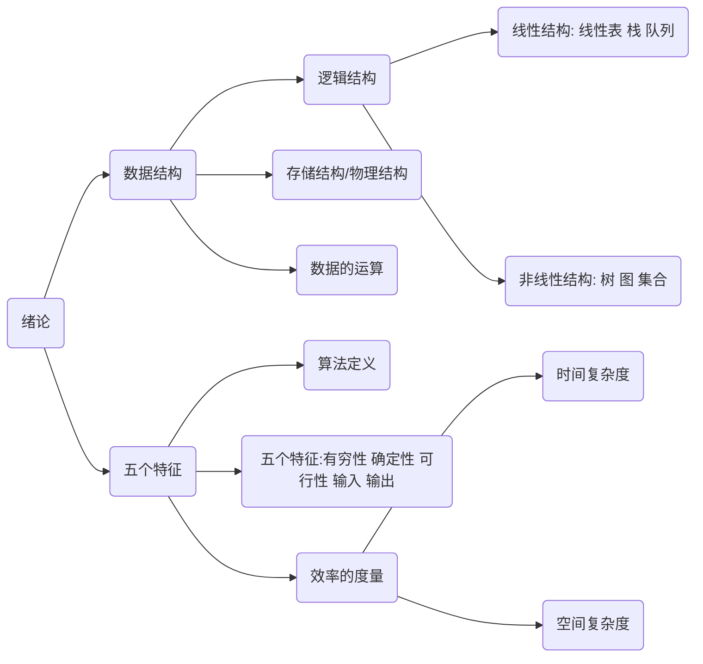

# Heading
[[toc]]

## 基本概念和术语  
### 数据  
数据是信息的载体，是描述客观事物属性的数、字符及所有能输入到计算机中并被计算机程序识别和处理的符号的集合。数据是计算机程序加工的原料。  
### 数据元素  
数据元素是数据的基本单位，通常作为一个整理进行考虑和处理。一个数据元素可由若干数据项组成，数据项是构成数据元素的不可分割的最小单位。  
### 数据对象  
数据对象是具有相同性质的数据元素的集合，是数据的一个子集。

### 数据类型
数据类型是一个值的集合和定义在此集合上的一组操作的总称。
- 原子类型：其值不可再分的数据类型。
- 结构类型：其值可以再分解为若干成分（分量）的数据类型。
- 抽象数据类型：抽象数据组织及与之相关的操作。

### 数据结构
数据结构是相互之间存在一种或多种特定关系的数据元素的集合。在任何问题中，数据元素都不是孤立存在的，它们之间存在某种关系，这种数据元素相互之间的关系称为结构（Structure）。数据结构包括三方面：：_逻辑结构_ 、 _存储结构_ 和 _数据的运算_。

## 数据结构的三要素
### 数据的逻辑结构
逻辑结构是指数据元素之间的逻辑关系，即从逻辑关系上描述数据。它与数据的存储无关，是独立于计算机的。数据的逻辑结构分为线性结构和非线性结构。线性表是典型的线性结构；集合、树、图是典型的非线性结构。
- 集合：结构中的数据元素除了“同属一个集合”外，无其他关系。
- 线性结构：数据元素只存在**一对一**的关系。
- 树形结构：数据元素之间存在**一对多**的关系。
- 图状或网状结构：数据元素之间存在**多对多**的关系。
### 数据的存储结构
存储结构是指数据结构在计算机中的表示（又称**映像**），也称**物理结构**。
- 顺序存储
把逻辑上相邻的元素存储在物理位置上也相邻的存储单元中，元素之间的关系由存储单元的领接关系来体现。
优点：**随机存取**，每个元素占用最少的存储空间
缺陷：只能使用相邻的一整块存储单元，因此可能**产生较多的外部碎片**。  
- 链式存储
不要求逻辑上相邻的元素存储在物理位置上也相邻，借助指示元素存储地址的指针来表示元素之间的逻辑关系。
优点：不会出现碎片现象，能**充分利用所有存储单元**。
缺陷：每个元素因存储指针而**占用额外的存储空间**，且**只能实现顺序存取**。  
- 索引存储
在存储元素信息的同时，还建立附加的索引表。索引表中的每项称为索引项，索引项的一般形式是（关键字，地址）。
优点：**检索速度快**
缺陷：附加的索引表**额外占用存储空间**；增删数据时也**要修改索引表**，因而会花费较多时间。  
- 散列存储
根据元素的关键字直接计算出该元素的存储地址，又称**哈希（Hash）存储**。
优点：检索、增加、删除节点的操作都很**快**。
缺陷：如果散列函数不好，可能出现**哈希冲突**，解决冲突会增加时间和空间开销。

### 数据的运算
施加在数据上的运算包括运算的定义和实现。运算的定义是针对逻辑结构的，指出运算的功能；运算的实现是针对存储结构的，指出运算的具体操作步骤。