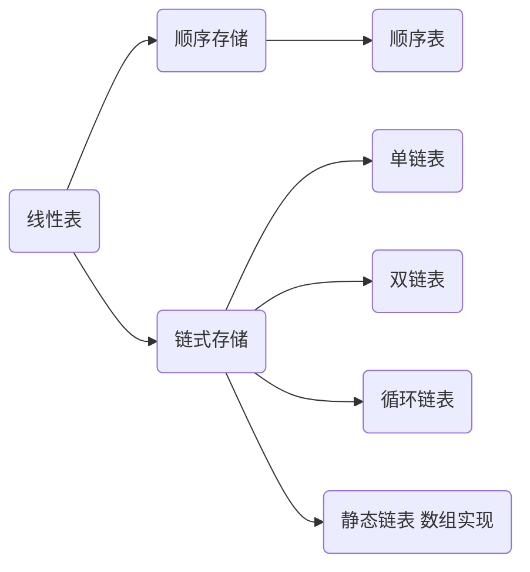

# Heading
[[toc]]

## 线性表的定义
线性表是具有相同数据类型的n(n>=0)个数据元素的有限序列，其中n为表长，当n= 0 时线性表是一个空表。
一般表示为：  
`L= (a1,a2,...,ai,...,an)`  
除第一个元素外，每个元素**有且仅有**一个直接前驱。除最后一个元素外，每个元素**有且仅有**一个直接后继。特点如下：  
1. 表中元素个数有限。
2. 表中元素具有逻辑上的顺序性，表中元素有其先后次序。
3. 表中元素都是数据元素，每个元素都是单个元素。
4. 表中元素的数据类型都相同。（占用相同大小的存储空间）
5. 表中元素具有抽象性。（仅讨论元素间的逻辑关系，不讨论元素内容）

::: warning
`线性表`是一种逻辑结构，表示元素之间一对一的相邻关系。`顺序表`和`链表`是指存储结构，两者属于不同层面的概念。
:::

### 线性表的基本操作

- 初始化表。构造一个空的线性表。
- 求表长，返回线性表L的长度。
- 按值查找。在表L中查找具有给定关键字值的元素。
- 按位查找。获取表L中第i个位置的元素的值。
- 插入。在表L中的第i个位置插入指定元素。
- 删除。删除表L中第i个位置的元素。
- 输出。按先后顺序输出所有元素值。
- 判空。
- 销毁。销毁线性表，释放内存。