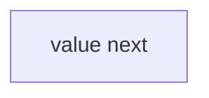
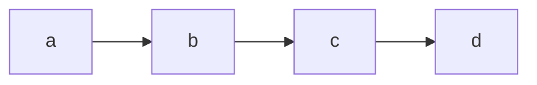

# Heading
[[toc]]

## 单链表的定义
线性表的链式存储又称`单链表`。它是通过一组任意的存储单元来存储线性表中的数据元素。为了建议数据元素之间的线性关系，对每个链表节点，除存放元素自身的信息外，还需要存放一个指向其后继的指针。

<<< @/src/algorithms/src/Node.js#ListNode

**利用单链表可以解决顺序表需要大量连续存储单元的缺点，但单链表附加指针域，也存在浪费空间的缺点**。 
由于单链表的元素离散地分布在存储空间中，所以单链表是`非随机存取`的数据结构，查找节点时，需要从头开始遍历，依次查找。  

通常用头指针来标识一个单链表，如单链表L，头指针为NULL时表示一个空表。
为了操作的方便，通常在单链表的第一个节点之前附加一个节点，称为`头结点`。头结点的数据域可以不设置任何信息，也可以记录表长等信息。头结点的指针域指向线性表的第一个元素节点。引入头结点后，**可以带来两个优点**：
1. 由于第一个数据节点的位置被存放在头结点的指针域中，所以在链表的第一个位置上的操作和在表的其他位置上的操作一致，无须进行特殊处理。
2. 无论链表是否为空，其头指针都指向头节点的非空指针（空表中头结点的指针域也为空），因此空表和非空表的处理也就得到了统一。


## 单链表的实现

`头插法`：将新节点插入链表表头（头结点之后）。  
采用头插法建议单链表时，读入数据的顺序与生成链表中的顺序是相反的。  
`尾插法`：将新节点插入链表表尾。  
需要设置一个表尾指针，始终指向链表的尾节点。  

::: details 点击查看代码
<<< @/src/algorithms/src/LinkList.js
:::

## 双链表
单链表节点中只有一个指向其后继的指针，使得单链表只能从头结点依次顺序地向后遍历。**要访问某个节点的前驱节点（插入、删除时），只能从头开始遍历**，访问后继节点的时间复杂度为**O(1)**，访问前驱节点的时间复杂度为**O(n)**。  
为了克服单链表上述缺点，引入了双链表，双链表结点中有两个指针prev，next，分别指向前驱结点和后继节点。

<<< @/src/algorithms/src/Node.js#DoublyListNode

双链表和`按值查找`和`按位查找`与单链表相同，`插入`和`删除`操作与单链表不同，因为“链”变化时需要对prev指针相应地作出修改，关键是保证**不断链**。
双链表因为有前驱指针，方便找前驱结点，插入、删除操作的时间复杂度仅为**O(1)**。

给定结点p之后插入q结点：
```js
    q.next = p.next;
    p.next.prev = q;
    q.prev = p;
    p.next = q;
```

删除给定结点p之后的q结点：
```js
    q.next.prev = p;
    p.next = q.next;
    q = null;
```

::: details 点击查看代码
<<< @/src/algorithms/src/DoublyLinkList.js
:::


## 循环链表
### 循环单链表
循环单链表和单链表的区别在于，表中最后一个结点的指针不是NULL，而是改为指向头结点，从而使整个链表形成一个环。  
循环单链表的判空条件**不是头结点的指针是否为空，而是它是否等于头指针**。  
正因为循环单链表是一个“环”，因此在**任何位置上的插入和删除操作都是等价**的，无须判断是否是表尾。  
在单链表中只能从表头开始往后顺序遍历整个链表，而循环单链表**可以从表中任何一个结点开始遍历整个链表**。有时对单链表常做的操作是在表头和表尾进行的，此时**对循环单链表不设置头指针而仅设置尾指针**，从而使得操作效率更高。其原因是，若设置头指针，对表尾操作需要O(n)的时间复杂度，而若设置尾指针r，*r->next即为头指针*，对于表头与表尾进行操作都只需要O(1)的时间复杂度。

### 循环双链表
由循环单链表的定义不难推出循环双链表。不同的是在循环双链表中，**头结点的prev指针还要指向尾结点**。


## 静态链表
静态链表借助*数组*来描述线性表的链式存储结构，结点也有数据域data和指针域next，与链表的指针不同的是，这里的指针是结点的相对地址（数组下标），又称*游标*。和顺序表一样，静态链表也要预先分配一块连续的内存空间。  

单链表和静态链表对比如下：  


数组下标 |data域 |指针域
:-       |:-     |-:
0        |       |2
1        |b      |6
2        |a      |1
3        |d      |-1
4        |       |
5        |       |
6        |c      |3

结构描述如下：

<<< @/src/algorithms/src/Node.js#StaticListNode

静态链表以`next == -1`作为其结束的标志。静态链表的插入、删除操作与动态链表相同，只需要修改指针，而不需要移动元素。筒体来说，静态链表没有单链表使用起来方便，但在一些不支持指针的高级语言（如Basic）中，这是一种非常巧妙的设计方法。