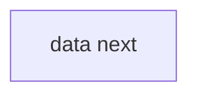

# Heading
[[toc]]

## 单链表的定义
线性表的链式存储又称`单链表`。它是通过一组任意的存储单元来存储线性表中的数据元素。为了建议数据元素之间的线性关系，对每个链表节点，除存放元素自身的信息外，还需要存放一个指向其后继的指针。

**利用单链表可以解决顺序表需要大量连续存储单元的缺点，但单链表附加指针域，也存在浪费空间的缺点**。 
由于单链表的元素离散地分布在存储空间中，所以单链表是`非随机存取`的数据结构，查找节点时，需要从头开始遍历，依次查找。  

通常用头指针来标识一个单链表，如单链表L，头指针为NULL时表示一个空表。
为了操作的方便，通常在单链表的第一个节点之前附加一个节点，称为`头结点`。头结点的数据域可以不设置任何信息，也可以记录表长等信息。头结点的指针域指向线性表的第一个元素节点。引入头结点后，**可以带来两个优点**：
1. 由于第一个数据节点的位置被存放在头结点的指针域中，所以在链表的第一个位置上的操作和在表的其他位置上的操作一致，无须进行特殊处理。
2. 无论链表是否为空，其头指针都指向头节点的非空指针（空表中头结点的指针域也为空），因此空表和非空表的处理也就得到了统一。

## 单链表的实现

`头插法`：将新节点插入链表表头（头结点之后）。  
采用头插法建议单链表时，读入数据的顺序与生成链表中的顺序是相反的。  
`尾插法`：将新节点插入链表表尾。  
需要设置一个表尾指针，始终指向链表的尾节点。  

::: details 点击查看代码
<<< @/src/algorithms/src/LinkList.js
:::

## 双链表

::: details 点击查看代码
<<< @/src/algorithms/src/DLinkList.js
:::

## 循环链表

## 静态链表

