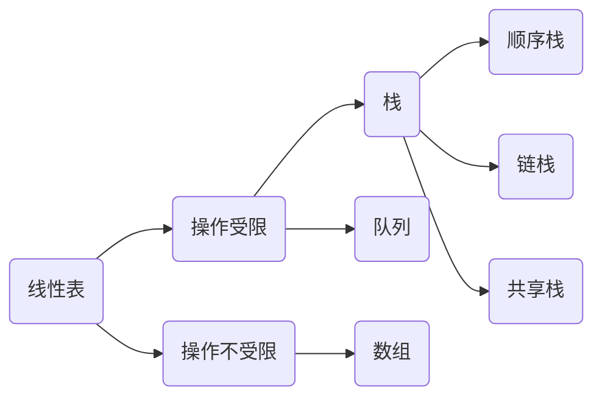

# Heading
[[toc]]

## 定义
**栈**（Stack）是`只允许在一端`进行`插入`或`删除`操作的`线性表`，特点是**后进先出（Last In First Out, LIFO）**。

- 栈顶 线性表允许进行插入删除的那一端。
- 栈底 固定的，不允许插入删除的那一端。
- 空栈 不含任何元素的空表。  

数学性质： n个不同的元素进栈，出栈元素不同排列的个数为卡特兰数（Catalan）。

## 基本操作
- InitStack 初始化一个空栈
- StackEmpty 判断栈空
- Push 进栈，若栈未满，则将x加入使之成为新栈顶
- Pop 出栈，若栈非空，返回栈顶元素
- GetTop 返回栈顶元素
- DestroyStack 销毁栈，释放内存
