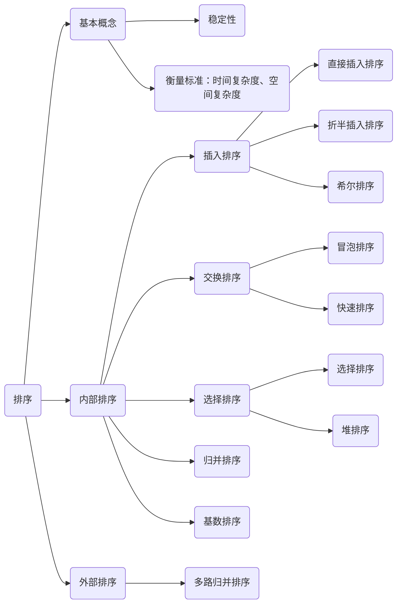

# Heading
[[toc]]

## 排序的定义
### 排序
排序就是重新排序表中的元素，使表中的元素满足按关键字有序的过程。  
一般情况下，内部排序算法都要执行两种操作：`比较`和`移动`。基数排序不基于比较。
### 算法的稳定性
若待排序表中有两个元素R1和R2，对应的关键字相同key1=key2，且排序前R1在R2前面，如果使用某一排序算法之后，R1仍在R2前面，则称这个算法是`稳定`的，否则称排序算法是`不稳定`的。
注意点：  
1. 算法是否具有稳定性并不能衡量一个算法的优劣，它主要描述算法的性质。（比如待排序表中关键字不重复，稳定性就无关紧要）
2. 对于不稳定的算法，只需举出一组关键字的实例，即可说明不稳定性。

### 排序算法的分类
- 内部排序
排序期间，元素全部放在内存中的排序。
- 外部排序
排序期间元素无法全部同时存放在内存中，必须在排序的过程中不断地内、外存之间移动的排序。

