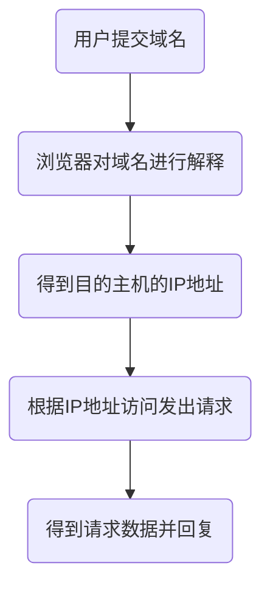

# Heading

[[toc]]

参考列表：

- [CDN](https://developer.mozilla.org/zh-CN/docs/Glossary/CDN)
- [CDN-百度百科](https://baike.baidu.com/item/CDN/420951?fr=aladdin)
- [CDN 技术详解](https://www.cnblogs.com/losbyday/p/5843960.html)

## 定义

MDN：
**CDN** 指的是一组分布在各个地区的服务器。这些服务器存储着数据的副本，因此服务器可以根据哪些服务器与用户距离最近，来满足数据的请求。 CDNs 提供快速服务，较少受高流量影响。

CDNs 被广泛用于传输 stylesheets 和 JavaScript 等静态资源，像 Bootstrap，Jquery 等。对这些库文件使用 CDN 技术，有以下几点好处：

- 通过 CDN 向用户分发传输相关库的静态资源文件，可以*降低我们自身服务器的请求压力*。
- 大多数 CDN 在全球都有服务器，所以 CDNs 上的服务器在地理位置上可能比你自己的服务器更接近你的用户。 _地理距离会按比例影响延迟_。
- CDNs 已经配置了恰当的*缓存*设置。使用 CDN 节省了在你的服务器中对静态资源文件的配置。

baidu：
**CDN**的全称是`Content Delivery Network`，即`内容分发网络`。CDN 是构建在现有网络基础之上的智能虚拟网络，依靠部署在各地的`边缘服务器`，通过中心平台的`负载均衡`、`内容分发`、`调度`等功能模块，使用户*就近获取所需内容，降低网络拥塞，提高用户访问响应速度和命中率*。CDN 的关键技术主要有`内容存储`和`分发技术`。
由于 CDN 是为加快网络访问速度而被优化的*网络覆盖层*，因此被形象地称为“网络加速器”。

## 组成

CDN 提供一种机制，当用户请求内容时，该内容能够由以最快速度交付的 Cache 来向用户提供，这个挑选“最优”的过程就叫做**负载均衡**

从功能上看，典型的 CDN 系统由`分发服务系统`，`负载均衡系统`和`运营管理系统`组成

- 分发服务系统：最基本的工作单元就是 Cache 设备，cache（边缘 cache）负责直接响应最终用户的访问请求，把缓存在本地的内容快速地提供给用 户。同时 cache 还负责与源站点进行内容同步，把更新的内容以及本地没有的内容从源站点获取并保存在本地。Cache 设备的数量、规模、总服务能力是衡 量一个 CDN 系统服务能力的最基本的指标
- 负载均衡系统：主要功能是负责对所有发起服务请求的用户进行访问调度，确定提供给用户的最终实际访问地址。两级调度体系分为全局负载均衡（GSLB）和本 地负载均衡（SLB）。GSLB 主要根据用户就近性原则，通过对每个服务节点进行“最优”判断，确定向用户提供服务的 cache 的物理位置。SLB 主要负 责节点内部的设备负载均衡
- 运营管理系统：分为运营管理和网络管理子系统，负责处理业务层面的与外界系统交互所必须的收集、整理、交付工作，包含客户管理、产品管理、计费管理、统计分析等功能。

负责为用户提供内容服务的 cache 设备应部署在物理上的网络边缘位置，即**CDN 边缘层**。CDN 系统中负责全局性管理和 控制的设备组成**中心层（二级缓存）**，中心层同时保存着最多的内容副本，当边缘层设备未命中时，会向中心层请求，如果在中心层仍未命中，则需要中心层向源站 `回源`（如果是流媒体，代价很大）

`CDN 骨干点`和 `CDN POP` 点在功能上不同，中心和区域节点一般称为骨干点，主要作为内容分发和边缘未命中时的服务点；边缘节点又被称为 POP（point of presence）节点，*CDN POP 点主要作为直接向用户提供服务的节点*

## 功能

归纳起来，CDN 具有以下主要功能：

1. 节省骨干网带宽，减少带宽需求量；
2. 提供服务器端加速，解决由于用户访问量大造成的服务器过载问题；
3. 服务商能使用 Web Cache 技术在本地缓存用户访问过的 Web 页面和对象，实现相同对象的访问无须占用主干的出口带宽，并提高用户访问因特网页面的相应时间的需求；
4. 能克服网站分布不均的问题，并且能降低网站自身建设和维护成本；
5. 降低“广播风暴（broadcast storm）”的影响，提高网络访问的稳定性。

## 主要特点

1. **本地 Cache 加速**：提高了企业站点（尤其含有大量图片和静态页面站点）的访问速度，并大大提高以上性质站点的稳定性。
2. **镜像服务**：消除了不同运营商之间互联的瓶颈造成的影响，实现了*跨运营商的网络加速*，保证不同网络中的用户都能得到良好的访问质量。
3. **远程加速**：远程访问用户根据 DNS 负载均衡技术智能自动选择 Cache 服务器，选择最快的 Cache 服务器，加快远程访问的速度。
4. **带宽优化**：自动生成服务器的远程 Mirror（镜像）cache 服务器，远程用户访问时从 cache 服务器上读取数据，减少远程访问的带宽、分担网络流量、减轻原站点 WEB 服务器负载等功能。
5. **集群抗攻击**：广泛分布的 CDN 节点加上节点之间的智能冗余机制，可以有效地预防黑客入侵以及降低各种 D.D.o.S 攻击对网站的影响，同时保证较好的服务质量 。

## 实现原理

CDN 的基本原理是**广泛采用各种缓存服务器，将这些缓存服务器分布到用户访问相对集中的地区或网络中，在用户访问网站时，利用全局负载技术将用户的访问指向距离最近的工作正常的缓存服务器上，由缓存服务器直接响应用户请求**。

在描述 CDN 的实现原理，让我们先看传统的未加缓存服务的访问过程，以便了解 CDN 缓存访问方式与未加缓存访问方式的差别：

### 未使用 CDN 访问过程

由上可见，用户访问未使用 CDN 缓存网站的过程为:

1. 1)、用户向浏览器提供要访问的域名；
2. 2)、浏览器调用域名解析函数库对域名进行解析，以得到此域名对应的 IP 地址；
3. 3)、浏览器使用所得到的 IP 地址，向域名的服务主机发出数据访问请求；
4. 4)、浏览器根据域名主机返回的数据显示网页的内容。

通过以上四个步骤，浏览器完成*从用户处接收用户要访问的域名到从域名服务主机处获取数据*的整个过程。

### 使用 CDN 访问过程

CDN 网络是在 用户和服务器之间增加 Cache 层，如何将用户的请求引导到 Cache 上获得源服务器的数据，主要是通过接管 DNS 实现，下面让我们看看访问使用 CDN 缓 存后的网站的过程：

通过上图，我们可以了解到，使用了 CDN 缓存后的网站的访问过程变为：

1. 1)、用户向浏览器提供要访问的域名；
2. 2)、浏览器调用域名解析库对域名进行解析，_由于 CDN 对域名解析过程进行了调整，所以解析函数库一般得到的是该域 名对应的 CNAME 记录，为了得到实际 IP 地址，浏览器需要再次对获得的 CNAME 域名进行解析以得到实际的 IP 地址_；在此过程中，使用的**全局负载均衡 DNS 解析**，如根据地理位置信息解析对应的 IP 地址，使得用户能就近访问。
3. 3)、此次解析得到 CDN 缓存服务器的 IP 地址，浏览器在得到实际的 IP 地址以后，向缓存服务器发出访问请求；
4. 4)、缓存服务器根据浏览器提供的要访问的域名，通过*Cache 内部专用 DNS 解析*得到此域名的实际 IP 地址，再由缓存服务器向此实际 IP 地址提交访问请求；
5. 5)、缓存服务器从实际 IP 地址得得到内容以后，一方面**在本地进行保存，以备以后使用**，另一方面把获取的数据返回给客户端，完成数据服务过程；
6. 6)、客户端得到由缓存服务器返回的数据以后显示出来并完成整个浏览的数据请求过程。
   通过以上的分析我们可以得到，为了实现既要*对普通用户透明*(即加入缓存以后用户客户端无需进行任何设置，直接使用被 加速网站原有的域名即可访问)，又要在为指定的网站提供加速服务的同时*降低对 ICP（Internet Content Provider）的影响*，只要**修改整个访问过程中的域名解析部分**，以实现透明的加速服务。

**ICP （网络内容服务商）**。因特网内容提供商英文全称为 Internet Content Provider 简写为 ICP，即向广大用户综合提供互联网信息业务和增值业务的电信运营商。其必须具备的证书即为 ICP 证。因特网内容提供商(ICP，Internet Content Provider)负责提供其网站的内容和与之相关的服务。

### CDN 网络实现的具体操作过程

1. 作为**ICP**，只需要**把域名解释权交给 CDN 运营商**，其他方面不需要进行任何的修改；操作时，ICP 修改自己域名的解析记录，一般用 cname 方式指向 CDN 网络 Cache 服务器的地址。
2. 作为**CDN**运营商，
   1. 首先需要为 ICP 的域名提供公开的解析，为了实现 sortlist（排序吗还是什么？），一般是**把 ICP 的域名解释结果指向一个`CNAME`记录**；
   2. 当需要进行 sortlist 时，CDN 运营商可以利用 DNS 对 CNAME 指向的域名解析过程进行特殊处理，使 DNS 服务器在接收到客户端请求时可以**根据客户端的 IP 地址，返回相同域名的不同 IP 地址**；
   3. 由于从 cname 获得的 IP 地址，并且带有`hostname`信息，请求到达`Cache`之后，`Cache`必须知道源服务器的 IP 地址，所以在 CDN 运营商内部维护一个**内部 DNS 服务器，用于解释用户所访问的域名的真实 IP 地址**；
   4. 在维护内部 DNS 服务器时，还需要维护一台**授权服务器**，控制哪些域名可以进行缓存，而哪些又不进行缓存，以免发生开放代理的情况。
