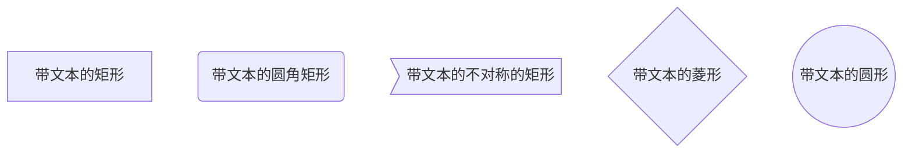
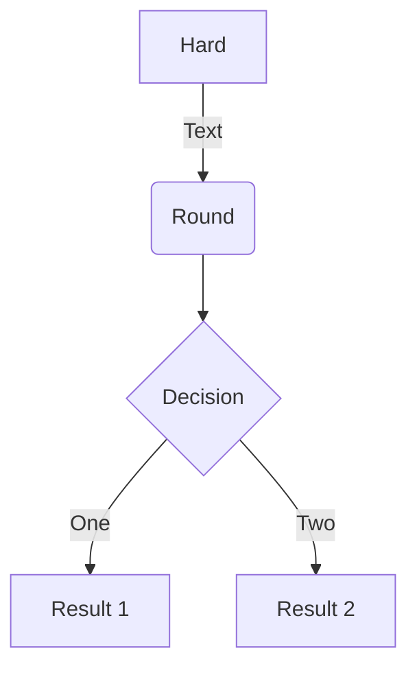
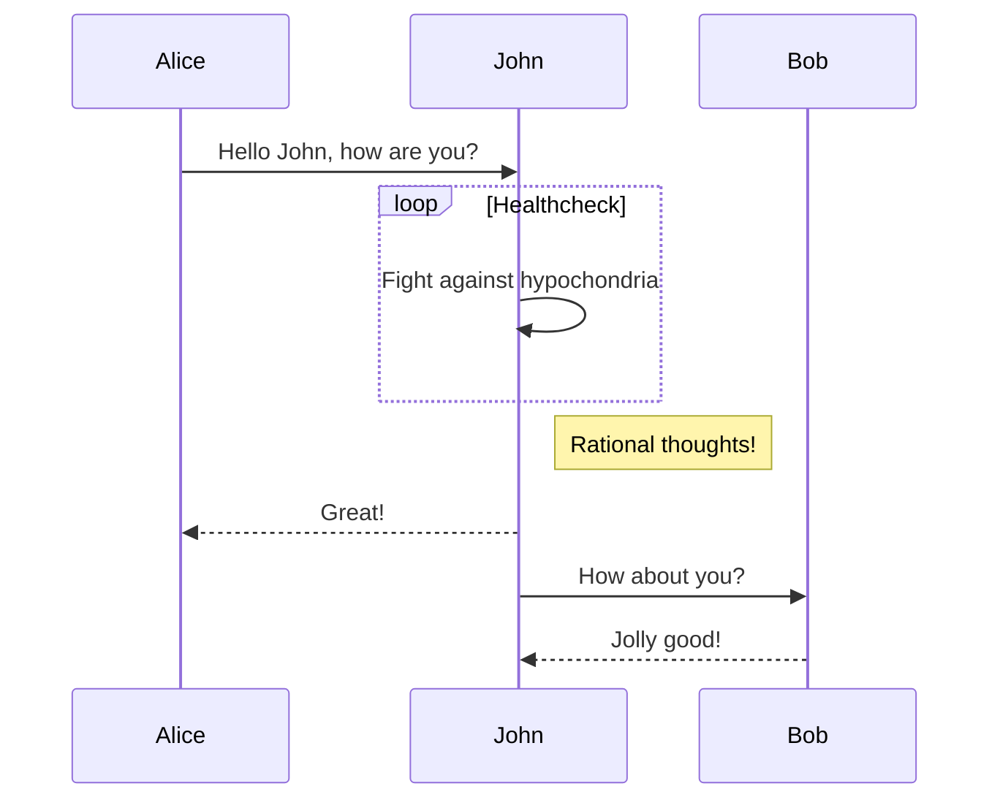
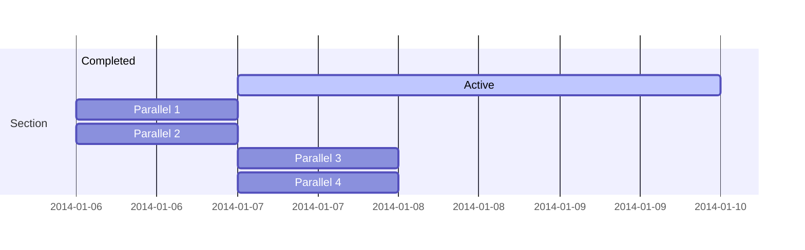
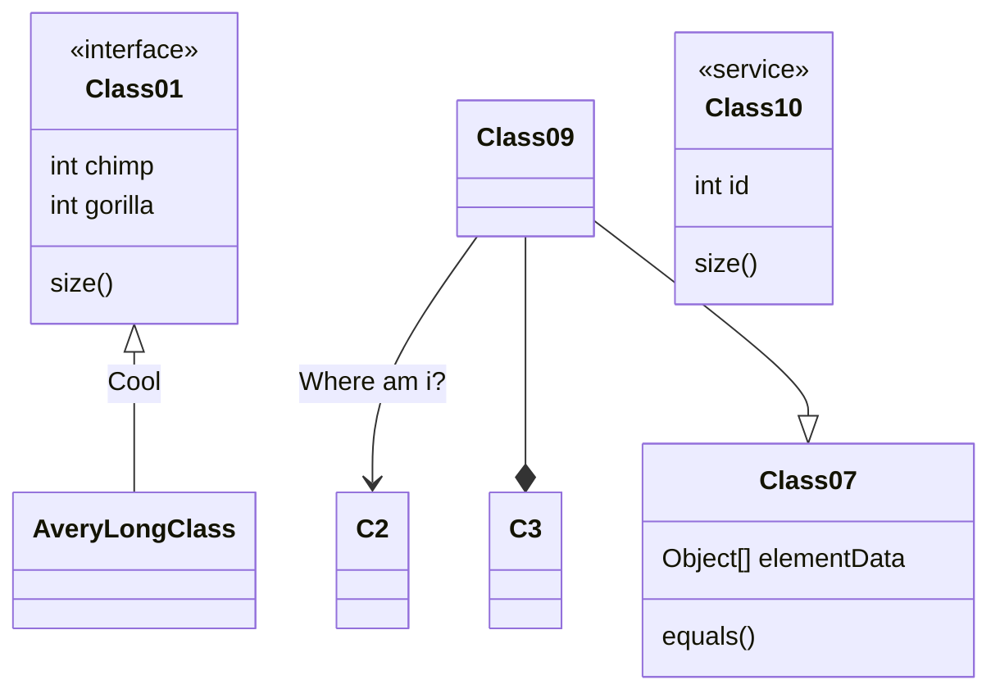
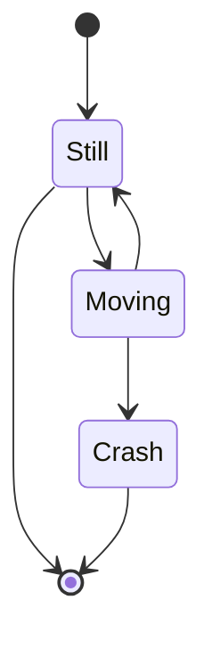
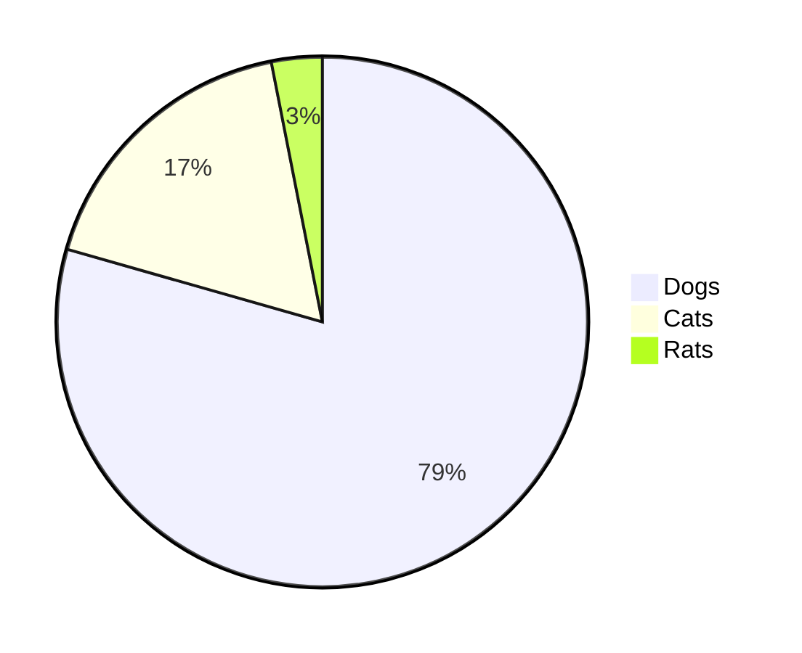
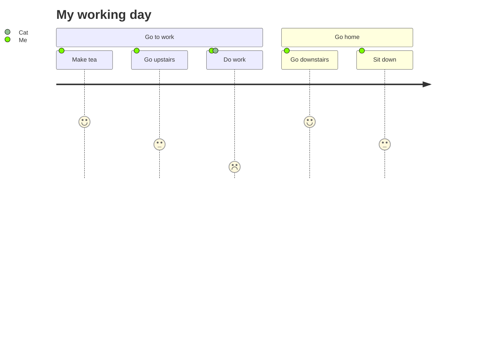

# Heading
[[toc]]


## TODO-LIST
- [ ] 多行字符串怎么实现KMP算法？  
- [ ] CI/CD  
- [x] giuhub tag https://www.jianshu.com/p/36202c29e6ae  
- [ ] Node.js
- [ ] TypeScript
- [ ] 数据结构-排序
- [ ] 数据结构-图
- [ ] webpack
- [ ] 数据结构 - 链表实现（双链表、循环链表）
- [x] 0.5px的线
- [ ] HTTP1.0、HTTP1.1 和 HTTP2.0 的区别
- [x] script标签 defer属性和async属性
- [ ] nginx 性能高的原因
- [ ] nginx upstream
- [ ] png8 png24
- [ ] JS的垃圾回收
- [x] CSS实现两列布局，一列固定宽度，一列宽度自适应方法
- [x] 重绘和重排
- [x] requestAnimationFrame()
- [ ] 原生fetch
- [x] 垂直居中的实现方法
- [x] call apply bind
- [ ] 最有成就感的一件事
- [ ] 两个树比较的时间复杂度
- [x] 前端性能优化  
- [ ] TransForm 
  - https://developer.mozilla.org/zh-CN/docs/Web/CSS/transform-function#matrix
- [ ] Flex弹性布局
  - https://developer.mozilla.org/zh-CN/docs/Web/CSS/CSS_Flexible_Box_Layout/Basic_Concepts_of_Flexbox#flexbox_%E7%9A%84%E4%B8%A4%E6%A0%B9%E8%BD%B4%E7%BA%BF
- [ ] Grid网格布局
  - https://developer.mozilla.org/zh-CN/docs/Web/CSS/grid-template
  - http://www.ruanyifeng.com/blog/2020/08/five-css-layouts-in-one-line.html
- [ ] 闭包
  - [ ] https://developer.mozilla.org/zh-CN/docs/Web/JavaScript/A_re-introduction_to_JavaScript
- [ ] vue
  1. Vue 响应式原理
  2. computed 的实现原理
  3. computed 和 watch 有什么区别及运用场景?
  4. 为什么在 Vue3.0 采用了 Proxy,抛弃了 Object.defineProperty？
  5. Vue 中的 key 到底有什么用？
  6. 谈一谈 nextTick 的原理
  7. vue 是如何对数组方法进行变异的 ?
  8. Vue 组件 data 为什么必须是函数 ?
  9. 谈谈 Vue 事件机制,手写$on,$off,$emit,$once
  10. 说说 Vue 的渲染过程
  11. 聊聊 keep-alive 的实现原理和缓存策略
  12. vm.$set()实现原理是什么?

## 自定义容器
::: tip
这是一个提示
:::

::: warning
这是一个警告
:::

::: danger
这是一个危险警告
:::

::: details 点击查看代码
这是一个详情块，在 IE / Edge 中不生效
:::

## 代码块中的语法高亮
``` js {4}
export default {
  data () {
    return {
      msg: 'Highlighted!'
    }
  }
}
```
行数区间: 例如 {5-8}, {3-10}, {10-17}
多个单行: 例如 {4,7,9}
行数区间与多个单行: 例如 {4,7-13,16,23-27,40}

## emoji
完整路径：https://github.com/markdown-it/markdown-it-emoji/blob/master/lib/data/full.json  

:tada: :100:
 

## 文件部分导入 
<<< @/docs/99.其他/pm2介绍.md#test2
<<< @/docs/99.其他/testsnippet.js#test2

## 流程图

**FLOW**





### **Sequence**  

### **Gantt**


### **Class**



### **State**

### **Pie**


### **User Journey**


### **Git**
```mermaid
Coming soon!
```
## iframe
<iframe style="height: -webkit-fill-available;width: -webkit-fill-available;" src="//player.bilibili.com/player.html?aid=457634965&bvid=BV185411L7Vj&cid=253515113&page=1" scrolling="no" border="0" frameborder="no" framespacing="0" allowfullscreen="true"> </iframe>

## 临时
https://blog.csdn.net/kuangshp128/article/details/98062662

https://github.com/Kononnable/typeorm-model-generator

https://blog.csdn.net/yehuozhili/article/details/108435028

https://www.jianshu.com/p/1c4650e3718a