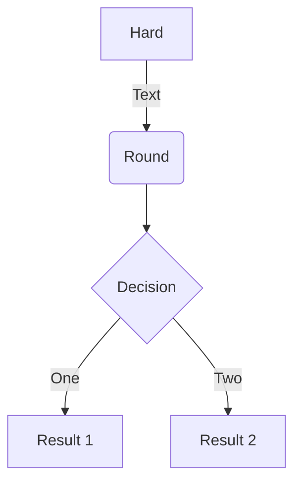
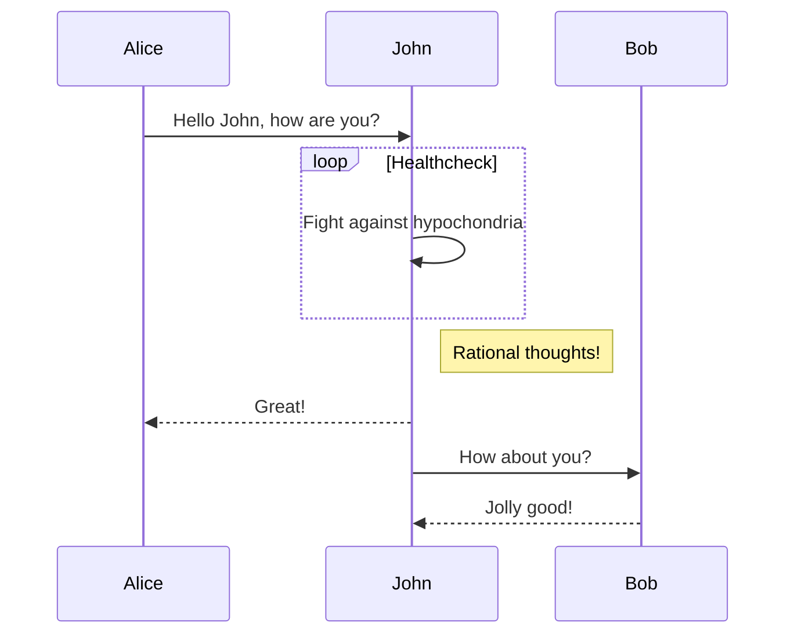
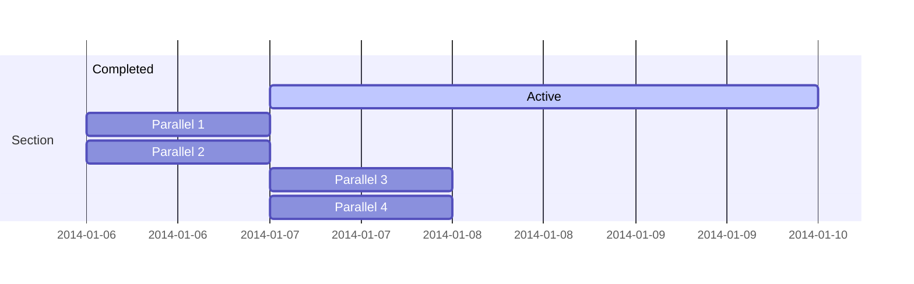
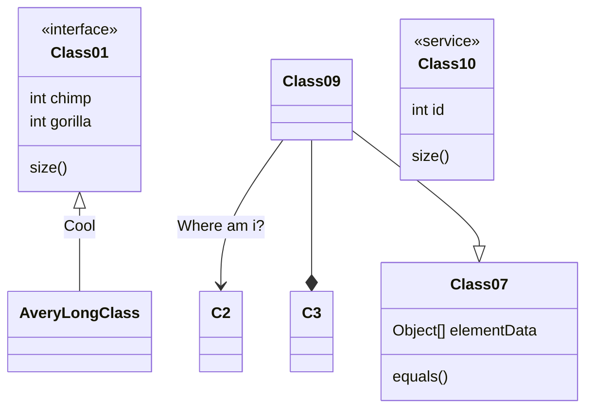
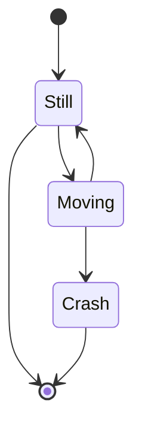
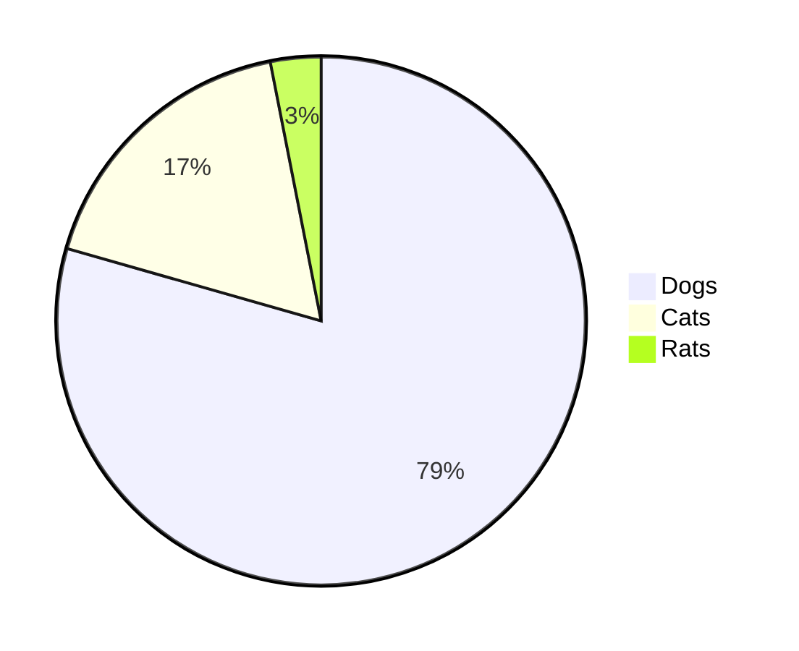
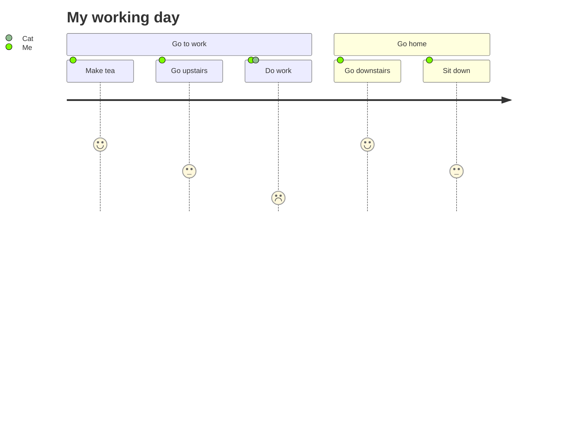

# Heading
[[toc]]


## TODO-LIST
- [ ] 多行字符串怎么实现KMP算法？  
- [ ] CI/CD  
- [x] giuhub tag https://www.jianshu.com/p/36202c29e6ae  
- [ ] Node.js
- [ ] TypeScript
- [ ] 数据结构-排序
- [ ] 数据结构-图
- [ ] webpack
- [ ] 数据结构 - 链表实现（双链表、循环链表）

## 自定义容器
::: tip
这是一个提示
:::

::: warning
这是一个警告
:::

::: danger
这是一个危险警告
:::

::: details 点击查看代码
这是一个详情块，在 IE / Edge 中不生效
:::

## 代码块中的语法高亮
``` js {4}
export default {
  data () {
    return {
      msg: 'Highlighted!'
    }
  }
}
```
行数区间: 例如 {5-8}, {3-10}, {10-17}
多个单行: 例如 {4,7,9}
行数区间与多个单行: 例如 {4,7-13,16,23-27,40}

## emoji
完整路径：https://github.com/markdown-it/markdown-it-emoji/blob/master/lib/data/full.json  

:tada: :100:
 

## 文件部分导入 
<<< @/docs/99.其他/pm2介绍.md#test2
<<< @/docs/99.其他/testsnippet.js#test2

## 流程图

**FLOW**




### **Sequence**  

### **Gantt**


### **Class**



### **State**

### **Pie**


### **User Journey**


### **Git**
```mermaid
Coming soon!
```
### iframe
<iframe style="height: -webkit-fill-available;width: -webkit-fill-available;" src="//player.bilibili.com/player.html?aid=457634965&bvid=BV185411L7Vj&cid=253515113&page=1" scrolling="no" border="0" frameborder="no" framespacing="0" allowfullscreen="true"> </iframe>